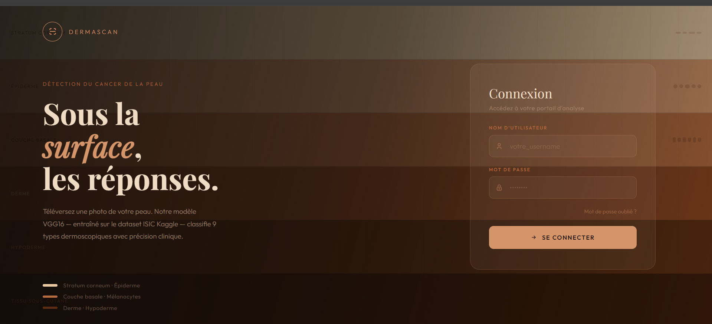
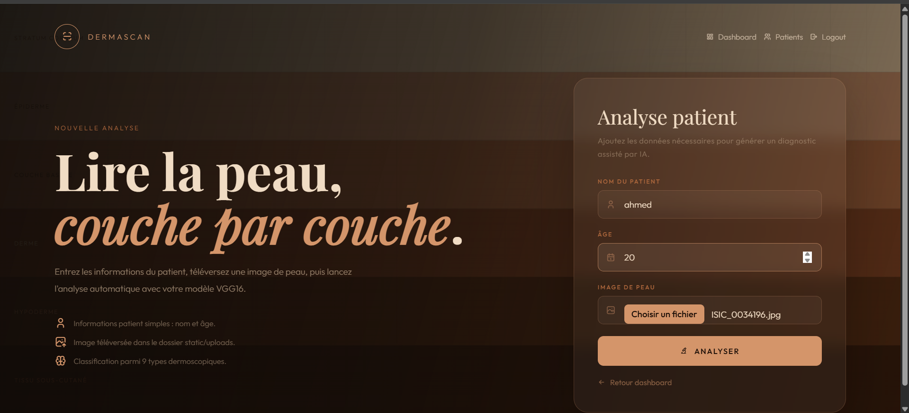
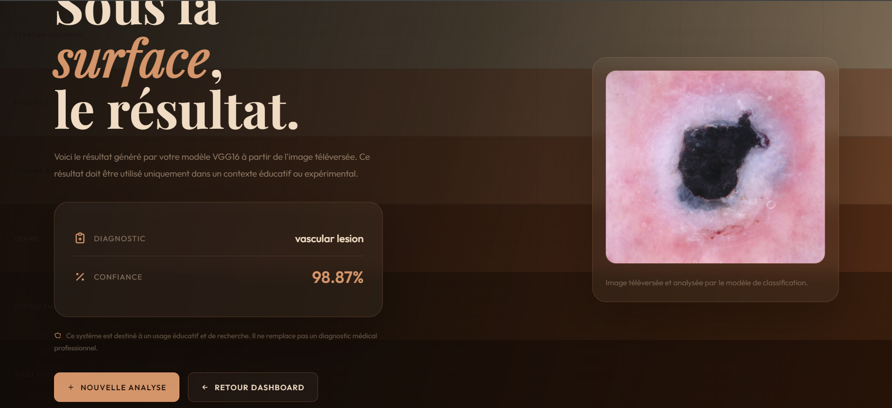
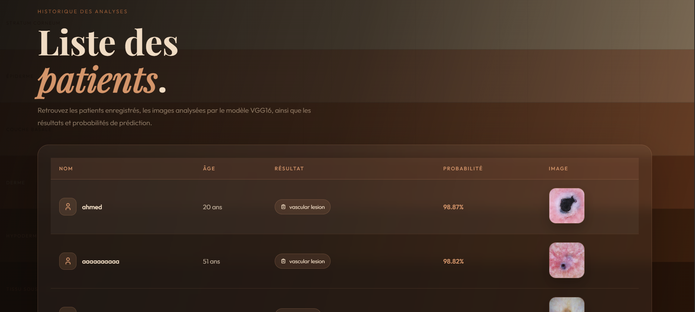

# Skin Cancer Detection - DermaScan

## Description

Skin Cancer Detection est une application web développée avec Flask permettant d'analyser une image de lésion cutanée et de prédire le type de maladie de peau à l'aide d'un modèle Deep Learning basé sur VGG16.

L'application permet à un utilisateur de se connecter, d'ajouter les informations d'un patient, d'envoyer une image de peau, puis d'obtenir une prédiction avec un pourcentage de confiance .

>  Cette application est réalisée dans un cadre académique/éducatif. Elle ne remplace pas un diagnostic médical professionnel.

## Fonctionnalités

- Authentification utilisateur
- Tableau de bord
- Upload d'images de lésions cutanées
- Prédiction automatique avec un modèle CNN VGG16
- Affichage du résultat avec le taux de confiance
- Affichage du Top 3 des prédictions
- Enregistrement des patients et résultats dans une base de données MySQL
- Consultation de l'historique des patients
- Visualisation des graphes de performance du modèle

  ## Classes détectées

Le modèle peut prédire les classes suivantes :

- Actinic keratosis
- Basal cell carcinoma
- Dermatofibroma
- Melanoma
- Nevus
- Pigmented benign keratosis
- Seborrheic keratosis
- Squamous cell carcinoma
- Vascular lesion

 ## Technologies utilisées

- Python
- Flask
- TensorFlow / Keras
- VGG16
- NumPy
- MySQL
- HTML
- CSS
- Gunicorn
- Google Drive / gdown

## Captures d’écran

### Login In Page

### Informations Page 

### Results Page

### Table of Patients 

## Démo vidéo
https://drive.google.com/file/d/1i-RjtF43E8SIkhT0PgyVs6LPujqULjST/view?usp=drive_link

